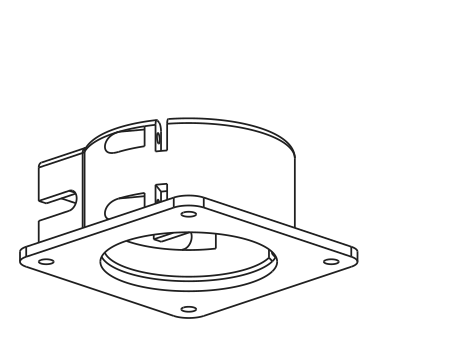
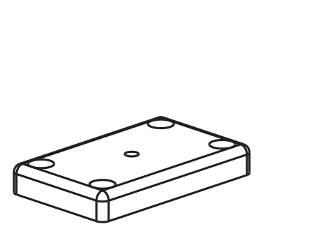
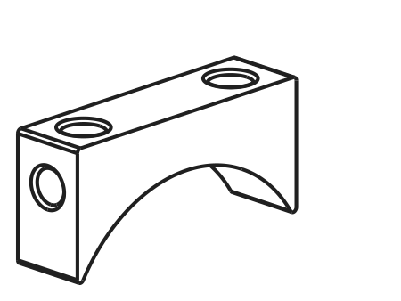
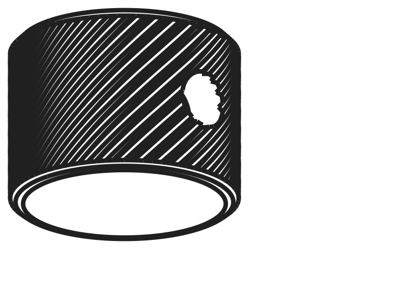

# Crayford Focuser for Telescopes

STEP files for a Crayford-style telescope focuser, based on the excellent original
design by **aeberbach**:

> [1.25" Crayford Focuser for Telescopes](https://www.printables.com/model/125438-125-crayford-focuser-for-telescopes)
> by aeberbach on Printables.com

All credit for the original design goes to aeberbach. This repository contains
modified and derivative STEP files adapted for my own telescope build.

## Parts

### Focuser Base

Main focuser body/base — `focuser_base.step`

**Changes from original:**

The original design uses nylon locknuts to retain the bearing axles, which creates
thin-walled geometry around the locknut voids that is fragile and prone to breaking
during assembly. In this version, M3×10 bolts serve directly as the axles, threading
cleanly into the holes without any additional hardware. Friction alone is sufficient
to keep them in place — there is no meaningful force trying to back them out during
normal use. Eliminating the locknut voids allows that section of the print to be
made thicker and more solid, improving both strength and printability.

The front face (where the front cap attaches) has also been modified to accept
M3 heat-set inserts rather than threading directly into plastic, giving the
cap-to-base joint a more durable and repeatable connection.

---

### Front Cap

Front cap for the focuser tube — `front_cap.step`

**Changes from original:**

The countersink holes use the ["Prusa trick"](https://blog.prusa3d.com/print-countersunk-screws-without-supports_52782/)
— the countersink is modeled as a polygon (rather than a cone) so it bridges cleanly
without supports. The part is oriented with its visible face flat against the build
plate, which produces a smooth finished surface for mounting the 37mm × 10mm × 3mm
plate.

---

### Pinion Block

Pinion block assembly — `pinion_block.step`

**Changes from original:**

The spring recesses have been enlarged to give more clearance for the springs that
press the 5mm drive rod against the aluminum strip on the draw tube. The corners
of the block have been slightly rounded, which reduces the sharp overhangs and
makes the part a little easier to print cleanly.

---

### Simple Knob

Focus knob — `simple_knob.step`

---

## License

This work is licensed under the
[Creative Commons Attribution-NonCommercial-ShareAlike 4.0 International License](https://creativecommons.org/licenses/by-nc-sa/4.0/),
consistent with the original design's license. See [LICENSE](LICENSE) for details.
